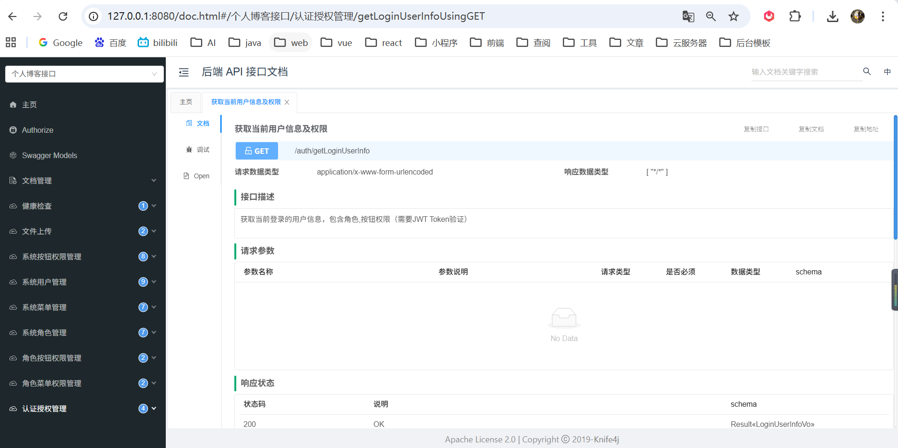
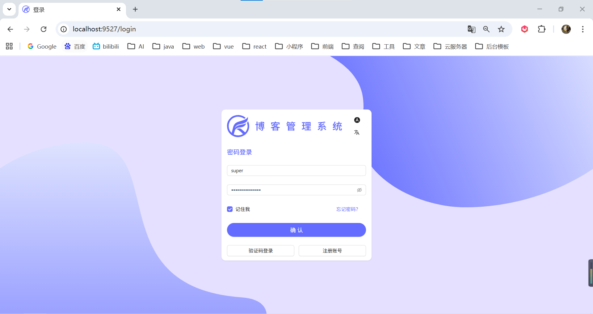
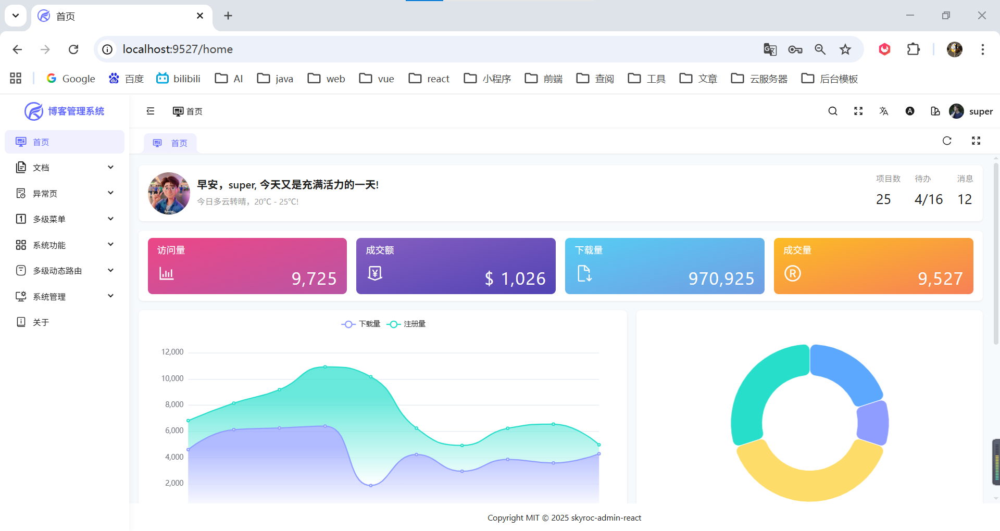
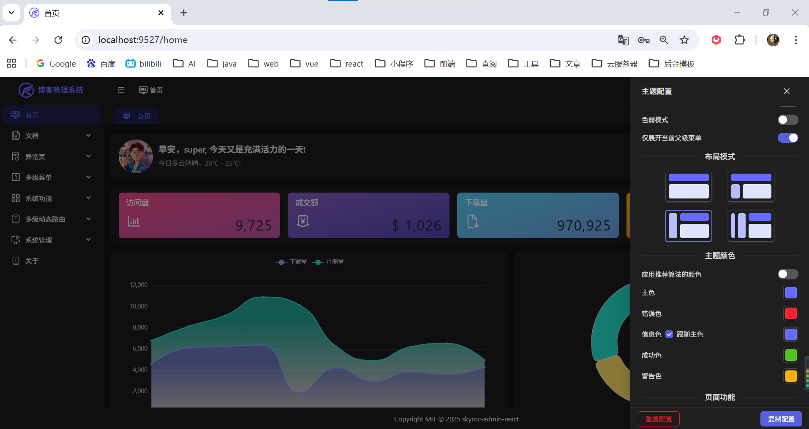
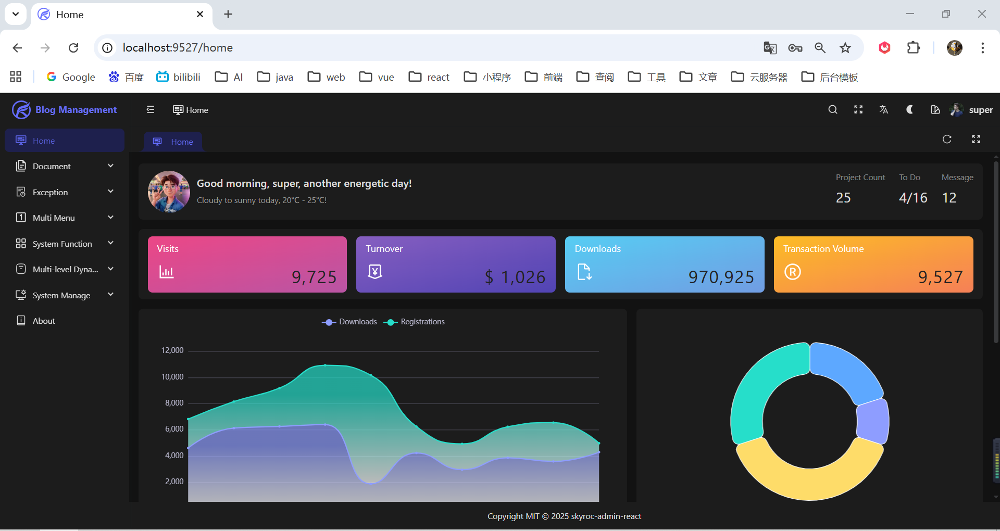
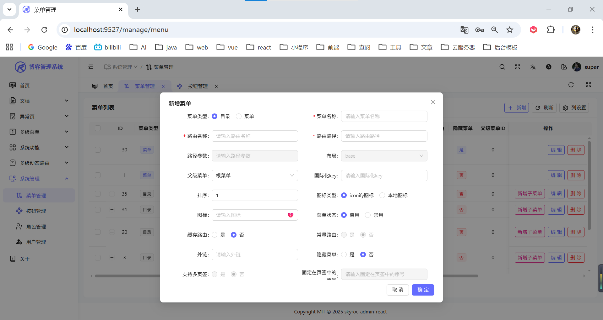
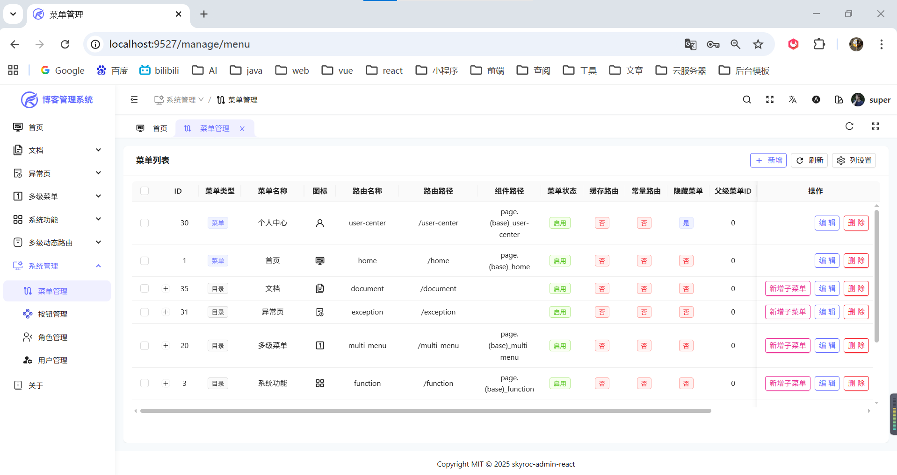
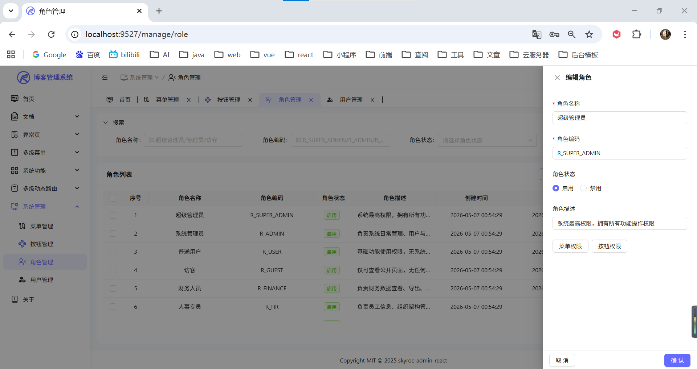
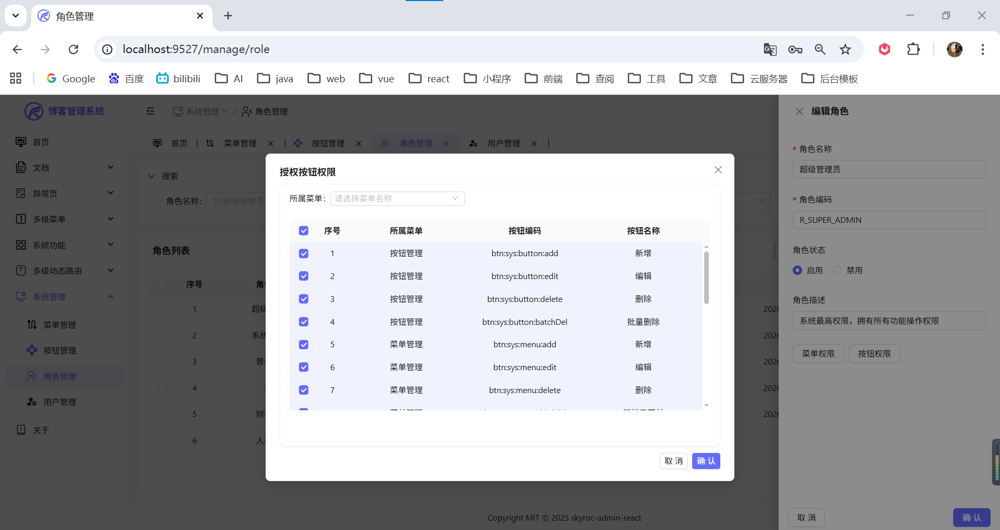
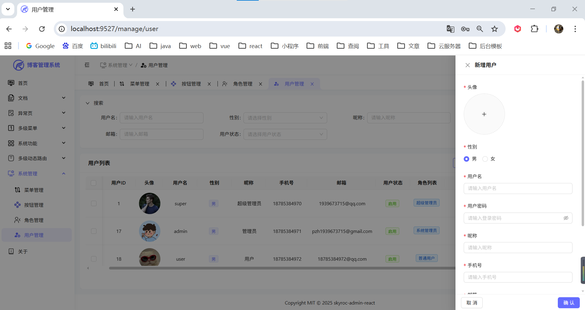

# 🚀 SkyRoc Admin API

**SkyRoc Admin 后台管理系统后端 API 服务**

技术栈：Spring Boot 2.7.6 | JWT 双 Token 认证 | RBAC 权限模型

---

## 🔗 配套项目

| 项目 | 描述 | 地址 |
|:---:|:---:|:---:|
| 🎨 **skyroc-admin-react** | React19 + Vite6 + Ant Design 5 前端 | [GitHub](https://github.com/pzhdv/skyroc-admin-react) |

---

## 📖 项目介绍

**SkyRoc Admin API** 是配套 [skyroc-admin-react](https://github.com/pzhdv/skyroc-admin-react) 的后端 API 服务，采用 Spring Boot 2.7.6 构建，提供完整的用户认证、权限管理、菜单管理等功能。

> 如果这个项目对你有帮助，欢迎点个 Star 支持一下！

---

## 📸 项目功能部分截图

### API接口文档


### 1. 登录页面


### 2. 首页


### 3. 主题配置


### 4. 中英文切换（国际化）


### 5. 菜单添加


### 6. 菜单管理


### 7. 按钮管理


### 8. 角色管理


### 9. 角色管理 - 按钮授权


### 10. 角色管理 - 菜单授权


### 11. 用户管理


---

## 🛠️ 技术栈

| 分类 | 技术 | 版本 | 说明 |
|:---:|:---:|:---:|:---|
| 🚀 基础框架 | Spring Boot | 2.7.6 | 后端核心框架 |
| ☕ 开发语言 | JDK | 17 | LTS 版本 |
| 📦 构建工具 | Maven | 3.6+ | 项目构建 |
| 🗄️ 数据库 | MySQL | 8.x | 关系型数据库 |
| 🔄 ORM | MyBatis-Plus | 3.5.15 | ORM 框架 |
| ⚡ 缓存 | Redis | - | 缓存与会话存储 |
| 🔐 安全认证 | JWT (JJWT) | 0.11.5 | 无状态身份认证 |
| 📚 API 文档 | Knife4j | 3.0.3 | 接口文档 |
| ☁️ 对象存储 | 腾讯云 COS SDK | 5.6.227 | 文件上传 |

---

## 📁 项目结构

```
skyroc-admin-api
│
├── src/main/java/cn/pzhdv/skyrocadminapi/
│   ├── config/          配置类（Redis、CORS、拦截器等）
│   ├── constant/        常量定义
│   ├── controller/      控制器层
│   ├── dto/             数据传输对象
│   ├── entity/          实体类
│   ├── exception/       异常处理
│   ├── help/            辅助工具
│   ├── interceptor/     JWT 拦截器
│   ├── mapper/          Mapper 接口
│   ├── result/          统一响应封装
│   ├── service/         业务逻辑层
│   ├── utils/           工具类
│   └── vo/              视图对象
│
└── src/main/resources/
    ├── mapper/                XML 映射文件
    ├── application.yml       主配置文件
    ├── application-dev.yml   开发环境配置
    ├── application-prod.yml  生产环境配置
    └── logback-spring.xml   日志配置
```

---

## 🎯 功能模块

| 模块 | 功能说明 |
|:---|:---|
| 🔐 **认证授权** | 用户登录 / 登出、Token 刷新、获取用户信息及权限菜单 |
| 👥 **用户管理** | 用户 CRUD、注册、状态管理 |
| 🎭 **角色管理** | 角色 CRUD、菜单权限分配、按钮权限分配 |
| 📑 **菜单管理** | 菜单树形结构、路由菜单生成 |
| 🔘 **按钮权限** | 细粒度按钮权限控制、角色按钮关联 |
| 📎 **文件管理** | 腾讯云 COS 上传、文件大小校验 |

---

## 🌲 菜单组件生成规则

`SysMenu` 类中 `component` 字段的生成规律：

**按 `menuType`（目录/菜单）+ `parentId`（根级/非根级）双维度判定**

```javascript
if (menuType === "1") {     // 目录类型
    if (parentId === 0) {    // 根级目录
        component = "layout.base";
    } else {                // 非根级目录
        component = "";
    }
} else if (menuType === "2") {  // 菜单类型
    if (parentId === 0) {       // 根级菜单
        component = `layout.base$view.${routeName}`;
    } else {                    // 子级菜单
        component = `view.${routeName}`;
    }
}
```

---

## ⚡ 快速开始

### 📦 环境要求

| 环境 | 版本 | 说明 |
|:---:|:---:|:---|
| JDK | 17+ | 推荐 LTS 版本 |
| Maven | 3.6+ | 项目构建 |
| MySQL | 8.x | 关系型数据库 |
| Redis | - | 缓存服务 |

### 配置数据库

创建数据库 `skyroc_admin_db`，修改 `application-dev.yml`：

```yaml
spring:
  datasource:
    url: jdbc:mysql://localhost:3306/skyroc_admin_db?useUnicode=true&characterEncoding=utf8&useSSL=false&serverTimezone=UTC
    username: root
    password: your_password
```

### 配置 Redis

```yaml
spring:
  redis:
    host: 127.0.0.1
    port: 6379
    password: your_redis_password
```

### 配置腾讯云 COS

```yaml
tencent:
  cos:
    secretId: your_tencent_cos_secret_id
    secretKey: your_tencent_cos_secret_key
    bucketName: your_cos_bucket_name
    region: ap-chongqing
```

| 参数 | 说明 |
|:---:|:---|
| secretId | 腾讯云访问密钥 ID |
| secretKey | 腾讯云访问密钥 Key |
| bucketName | COS 存储桶名称 |
| region | 地域节点（如 ap-chongqing、ap-beijing 等） |

### 启动项目

```bash
# 开发环境启动
mvn spring-boot:run

# 打包后运行
mvn clean package -DskipTests
java -jar target/skyroc-admin-api-0.0.1-SNAPSHOT.jar --spring.profiles.active=dev
```

### 访问接口文档

```
http://localhost:8080/skyrocApi/doc.html
```

---

## 📡 主要接口

| 模块 | 方法 | 路径 | 说明 |
|:---|:---:|:---:|:---|
| 🔐 认证 | POST | /auth/login | 用户登录 |
| 🔐 认证 | POST | /auth/logout | 用户登出 |
| 🔐 认证 | GET | /auth/userinfo | 获取用户信息 |
| 🔐 认证 | POST | /auth/refresh | 刷新 Token |
| 👥 用户 | GET | /system/user/list | 用户列表 |
| 👥 用户 | GET | /system/user/{id} | 用户详情 |
| 👥 用户 | POST | /system/user | 创建用户 |
| 👥 用户 | PUT | /system/user | 更新用户 |
| 👥 用户 | DELETE | /system/user/{id} | 删除用户 |
| 🎭 角色 | GET | /sys/role/list | 角色列表 |
| 🎭 角色 | GET | /sys/role/{id} | 角色详情 |
| 🎭 角色 | POST | /sys/role | 创建角色 |
| 🎭 角色 | PUT | /sys/role | 更新角色 |
| 🎭 角色 | DELETE | /sys/role/{id} | 删除角色 |
| 📑 菜单 | CRUD | /sys/menu/** | 菜单增删改查 |
| 🔘 按钮 | CRUD | /sys/button/** | 按钮权限管理 |

---

## 📦 响应格式

**成功响应：**

```json
{
  "code": 200,
  "msg": "success",
  "data": { }
}
```

**错误响应：**

```json
{
  "code": 500,
  "msg": "错误信息",
  "data": null
}
```

**状态码说明：**

| 状态码 | 说明 |
|:---:|:---|
| ✅ 200 | 请求成功 |
| ⚠️ 400 | 请求参数错误 |
| 🔒 401 | 未授权（Token 无效或已过期） |
| 🚫 403 | 权限不足 |
| ❓ 404 | 资源不存在 |
| ❌ 500 | 服务器内部错误 |

---

## 🔐 认证机制

项目采用 **JWT 双 Token** 机制：

| Token 类型 | 有效期 | 用途 |
|:---|:---:|:---|
| 🔑 Access Token | 1 小时 | 访问 API 接口 |
| 🔄 Refresh Token | 1 天 | 刷新 Access Token |

**请求头格式：**

```
Authorization: Bearer <access_token>
```

---

## ⚙️ 配置文件

```
application.yml         主配置（通用配置）
application-dev.yml     开发环境配置
application-prod.yml    生产环境配置
```

**环境切换：**

```bash
java -jar app.jar --spring.profiles.active=dev   # 开发
java -jar app.jar --spring.profiles.active=prod  # 生产
```

---

## 💻 开发指南

### 新增功能模块

```
1. 使用 MPCodeGenerator 生成基础代码
   ├── Controller 控制器
   ├── Service 服务层
   ├── Mapper 数据访问层
   └── Entity 实体类

2. 在 dto/ 目录添加请求参数封装类
3. 在 vo/ 目录添加响应数据封装类
4. 配置路由和权限菜单
```

### 代码规范

- ✓ 使用 Lombok 简化代码
- ✓ 遵循 RESTful API 设计规范
- ✓ 所有接口添加 Knife4j 注解
- ✓ 敏感配置使用环境变量管理

---

## 🙏 致谢

感谢以下开源项目的贡献：

- 💖 [**Spring Boot**](https://spring.io/projects/spring-boot) — 快速构建 Spring 应用的开发框架
- 🦆 [**MyBatis-Plus**](https://baomidou.com/pages/24112f/) — 强大的 ORM 增强工具
- 📚 [**Knife4j**](https://doc.xiaoyuan.cn/) — 增强的 Swagger 文档框架
- 🔐 [**JJWT**](https://jwt.io/) — JSON Web Token 实现库
- ☁️ [**腾讯云 COS**](https://cloud.tencent.com/product/cos) — 对象存储服务
- 🗄️ [**Redis**](https://redis.io/) — 高性能键值数据库

---

## 👨‍💻 作者信息

🧩 姓名：潘宗晖（PanZonghui）  
🌐 博客: https://pzhdv.cn  
📧 邮箱: 1939673715@qq.com  
🐙 GitHub: https://github.com/pzhdv  

---

**如果这个项目对你有帮助，请给个 ⭐ Star 支持一下！**
